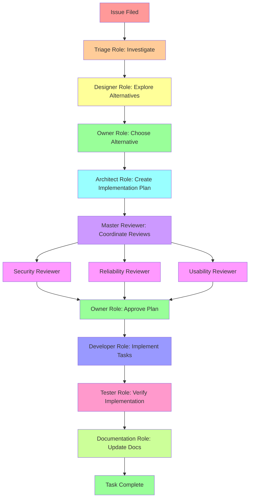

# StrandYard

**The role-oriented task management system that makes AI agents follow your workflow.**

StrandYard is a powerful CLI tool and MCP server designed to orchestrate AI agents through structured, multi-role workflows. Instead of letting AI agents work chaotically, StrandYard guides them through precise, repeatable processes using roles, templates, and human-readable task files.

## Why StrandYard?

Working with AI agents is powerful, but without structure, they can go off-track, skip important steps, or make decisions that should involve humans. Strand solves this by:

- **Enforcing workflows through roles** - Each role (Designer, Architect, Developer, Reviewer, etc.) has specific responsibilities and constraints
- **Embedding process into templates** - Task templates include role-specific TODO lists that guide agents step-by-step
- **Requiring human approval at key gates** - Owner role ensures critical decisions stay with humans
- **Making everything transparent** - All tasks, roles, and templates are stored as human-readable Markdown files

The result? AI agents that follow your process, collaborate effectively across specialized roles, and always keep humans in the loop for critical decisions.

## Features

### For Humans Working with AI Agents

- **CLI tool** - Simple commands to manage tasks, assign work, and track progress
- **MCP server** - Integrate Strand directly into AI agent workflows via Model Context Protocol
- **TUI dashboard** - Interactive terminal interface for visualizing and managing tasks
- **Web dashboard** - Real-time web interface for monitoring agent activity across projects
- **Customizable workflows** - Create your own roles and templates, or use built-in presets

### Workflow-as-Code



## Quick Start

### Installation

```bash
go install github.com/ricochet1k/strandyard/cmd/strand@latest
```

### Initialize Your First Project

```bash
# Initialize strand in your repository
strand init

# View available roles and templates
strand roles
strand templates

# Create your first task
strand add task "Implement user authentication"

# Let an AI agent pick up the next task
strand next

# When done, mark it complete
strand complete <task-id> "summary of work"
```

### Launch the Dashboards

```bash
# Terminal UI for quick task management
strand tui

# Web dashboard for visual monitoring
strand web
```

## Core Concepts

### Roles Define Responsibilities

Each role in Strand has clear responsibilities and constraints:

- **Owner** (Human) - Makes final decisions, approves plans, resolves conflicts
- **Designer** (AI/Human) - Explores alternatives, documents trade-offs
- **Architect** (AI/Human) - Creates implementation plans, breaks work into tasks
- **Developer** (AI/Human) - Implements features, writes code
- **Reviewers** (AI/Human) - Provide specialized review (security, reliability, usability)
- **Tester** (AI) - Verifies implementations work as expected
- **Documentation** (AI) - Maintains user-facing documentation
- **Triage** (AI) - Investigates issues and routes them appropriately

### Templates Embed Workflow

Task templates include role-specific TODO lists that guide execution:

```markdown
## TODOs
1. [ ] (role: developer) Implement the behavior described in Context.
2. [ ] (role: developer) Add unit and integration tests covering the main flows.
3. [ ] (role: tester) Execute test-suite and report failures.
4. [ ] (role: master-reviewer) Coordinate required reviews.
5. [ ] (role: documentation) Update user-facing docs and examples.
```

Agents use `strand next` to claim the next appropriate task for their role, follow the embedded instructions, and use `strand complete <task-id> "report"` when done.

### Human-Readable Storage

All tasks, roles, and templates are stored as Markdown files in `.strand/`:

```
.strand/
├── roles/           # Role definitions with responsibilities
├── templates/       # Task templates with embedded TODOs
└── tasks/          # Active and completed tasks
```

This means you can inspect, edit, or debug workflows using any text editor - no special tools required.

## Advanced Usage

### Custom Roles and Templates

Strand supports customizable workflows through presets. Create your own roles and templates to match your team's process:

```bash
# List available presets
strand presets list

# Create a custom role
strand roles add custom-role.md

# Create a custom template
strand templates add custom-template.md
```

### Multi-Project Management

The web dashboard watches all your Strand projects and provides a unified view:

```bash
# Start the multi-project web server
strand web

# Filter to specific projects
STRAND_STORAGE=local strand web   # Only local projects
STRAND_STORAGE=global strand web  # Only global projects
```

### AI Agent Integration

Configure AI agents to use Strand commands in their workflows:

```bash
# AI agent workflow example:
1. strand next --role developer     # Claim next developer task
2. # ... implement the feature ...
3. strand complete <task-id> "report"  # Mark complete
4. strand next                      # Get next available task
```

## Environment Variables

- `STRAND_ROOT` - Override git root detection (optional)
- `STRAND_STORAGE` - Filter projects: "global", "local", or empty for both (optional)

## Development

### Building from Source

```bash
# Build the dashboard and binary
./scripts/build-web.sh

# Or build just the binary
go build -o strand ./cmd/strand
```

### Dashboard Development

For hot-reload development of the web UI:

```bash
# Terminal 1: Start the API server
strand web --no-open

# Terminal 2: Start Vite dev server
cd apps/dashboard
npm run dev
# Visit http://localhost:5173
```

## Project Structure

- `cmd/strand/` - Main CLI entry point
- `cmd/` - Cobra command implementations
- `pkg/task/` - Task parsing and management
- `pkg/web/` - Web server and API
- `apps/dashboard/` - SolidJS web UI
- `.strand/roles/` - Built-in role definitions
- `.strand/templates/` - Built-in task templates

## Contributing

Strand is designed to be extended. Contributions for new roles, templates, and workflow presets are welcome.

## License

[Add license information]
