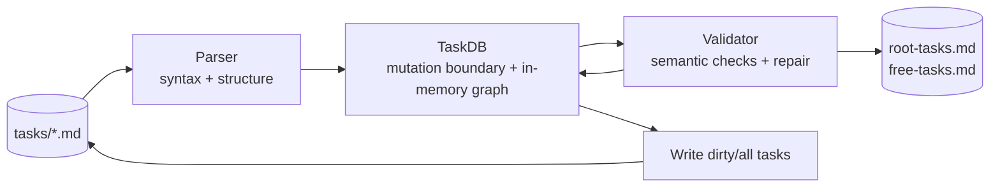

# TaskDB Responsibilities and Boundaries

## Context and decision records
- Parent review: `Ti6zj` (TaskDB API Design Review)
- Task: `Thyd1` (Document TaskDB responsibilities and boundaries)
- `pkg/task/TASKDB_DESIGN.md`
- `pkg/task/doc.go`
- `pkg/task/taskdb.go`
- `pkg/task/parser.go`
- `pkg/task/repair.go`
- `design-docs/task-go-structure-review.md`
- `design-docs/parser-go-task-loading-review.md`
- `design-docs/taskdb-access-control-strategy.md`
- `design-docs/blockers-relationship-management-review.md`
- `design-docs/taskdb-api-implementation-plan.md`

## Task selection output
```text
Your role is developer. Here's the description of that role:

---
description: "Implements tasks, writes code, and produces working software."
---

# Developer

## Role
Developer (human or AI) — implements tasks, writes code, and produces working software.

## Responsibilities
- Implement tasks assigned by the Architect
- Write clean, maintainable code following project conventions
- Add tests for new functionality
- Document code and update relevant documentation
- Fix bugs and address issues
- Ensure code passes validation and tests before marking tasks complete

## Deliverables
- Working code that meets acceptance criteria
- Tests covering the implemented functionality
- Updated documentation as needed
- Code that passes `go build` and `go test`

## Workflow
1. Read the assigned task and understand acceptance criteria
2. Implement the functionality described in the task
3. Write tests to verify the implementation
4. Run repair: `go build ./...`, `go test ./...`, `strand repair`
5. Update task status and mark as completed when done, including a brief report of what was accomplished: `strand complete <task-id> "Summary of work"`

## Constraints
- Follow existing code patterns and conventions in the codebase
- Ensure all changes are backward compatible unless explicitly noted
- Do not modify task metadata manually - use CLI commands

---

Ancestors:
  Ti6zj: TaskDB API Design Review


Your task is Thyd1-document-taskdb-responsibilities-and-boundaries. Here's the description of that task:

---
type: task
role: developer
priority: medium
parent: Ti6zj-taskdb-api-design-review
blockers: []
blocks:
    - Ti6zj-taskdb-api-design-review
date_created: 2026-01-31T17:19:12.718571Z
date_edited: 2026-02-15T04:54:26.060135Z
owner_approval: false
completed: false
status: in_progress
description: ""
---

# Document TaskDB responsibilities and boundaries

## Context
Provide links to relevant design documents, diagrams, and decision records.

## Description
Define what TaskDB should and shouldn't do:
- What operations belong in TaskDB?
- What belongs in separate packages/types?
- What's the relationship between TaskDB, Parser, Validator?
- Should TaskDB own the task map, or just coordinate operations?
- Define clear boundaries and interfaces
- Document the overall architecture

## Escalation
Tasks are disposable. Use follow-up tasks for open questions/concerns. Record decisions and final rationale in design docs; do not edit this task to capture outcomes.

## Acceptance Criteria
- Clear, runnable steps to reproduce locally.
- Tests covering functionality and passing.
- Required reviews completed and blockers cleared.
```

## Architecture boundaries

### TaskDB owns
- In-memory task graph ownership for loaded tasks (`map[string]*Task`) and dirty tracking lifecycle.
- Mutation APIs that must preserve graph invariants and deterministic ordering (`SetParent`, `AddBlocker`, `SetStatus`, todo/subtask mutators, reconciliation calls).
- Persistence orchestration (`Save`, `SaveDirty`, `SaveAll`) and task-ID resolution helpers used by command handlers.
- Coordination entrypoints that combine operations safely (for example `SetStatusWithReport` + blocker update semantics).

### Parser owns
- File reading and markdown/YAML parsing into `Task` structs (`ParseFile`, `ParseString`, `LoadTasks`).
- Frontmatter syntax validation and parse-time error context.
- Zero graph semantics: parser must not normalize relationships, enforce role existence, or mutate cross-task invariants.

### Validator owns
- Graph-wide semantic checks and normalization/repair passes (`ValidateAndRepair`, `FixMissingReferences`, parent TODO sync, role/ID/status checks).
- Data quality enforcement that can run after loading and before writing.
- Master-list generation (`root-tasks.md`, `free-tasks.md`) from normalized task state.

### Command/web handlers own
- UX concerns (flag parsing, prompts, output formatting, HTTP request/response).
- Selecting the correct TaskDB operation sequence per user action.
- They should not perform direct relationship/status field writes.

## Relationship model: TaskDB, Parser, Validator



Interpretation:
- Parser converts bytes to structs.
- TaskDB is the primary mutation boundary and runtime graph owner.
- Validator validates and repairs semantics across the full loaded set.
- Persistence and master-list updates happen from post-validation/reconciled state.

## Operation-to-boundary map

| Operation | Boundary | Reason |
| --- | --- | --- |
| Load markdown files from disk | Parser (invoked by TaskDB) | I/O + parse concern; no semantic ownership. |
| Parse YAML and markdown sections | Parser | Syntax responsibility. |
| Resolve short IDs/prefixes | TaskDB | Requires loaded graph context for command workflows. |
| Parent/blocker/status updates | TaskDB | Must preserve invariants through one mutator surface. |
| Cross-task semantic verification | Validator | Graph-wide checks are independent of command UX. |
| Missing-reference cleanup | Validator (typically via TaskDB orchestration) | Data repair concern, not parser concern. |
| Master list generation | Validator/repair pipeline | Derived artifact generation from validated graph. |
| CLI prompt/output and HTTP shape | cmd/pkg/web layers | Interface-only concern; should call TaskDB APIs. |

## Should TaskDB own the task map?

### Alternative A: TaskDB owns canonical in-memory map (recommended)
Pros:
- Clear single writer for in-memory state during a command flow.
- Simplifies dirty tracking and deterministic save behavior.
- Matches current API shape and migration plan.

Cons:
- If mutable `*Task` objects are exposed directly, callers can bypass invariants.
- Requires complementary access-control changes to reduce unsafe writes.

### Alternative B: TaskDB as stateless coordinator over external store
Pros:
- Cleaner separation between storage and mutation orchestration.
- Easier to swap storage backend in theory.

Cons:
- More plumbing and transaction complexity for current project size.
- Greater risk of partial updates if orchestration leaks into callers.

Decision: deferred to owner. Current codebase aligns with Alternative A, with access-control hardening tracked in `T8bgf`.

## Interface boundaries to enforce
- TaskDB public API should expose safe mutators and read helpers, not raw mutation paths that bypass invariants.
- Parser API should remain parse-focused and return raw parsed relationship fields without graph normalization.
- Validator API should operate on loaded sets and report/fix semantic issues deterministically.
- Command and web code should treat TaskDB as the single mutation boundary and avoid direct `Task.Meta` relationship/status edits.

## Open decisions and dependencies
- Access-control mechanism for `Task`/`Metadata` mutability (`T8bgf`) determines how strongly the TaskDB boundary is compile-time enforced.
- Relationship API contraction and naming (`Tx4jn`, `Tb0oq`) determine final public surface.
- Template-only creation contract (`Txvyh`) determines final replacement for `GetOrCreate`.

## Reproduction steps
```bash
go test ./pkg/task -run 'TaskDB|Parse|Validate|Repair'
go build ./...
go test ./...
go run ./cmd/strand repair
```

## Validation results
```bash
go test ./pkg/task -run 'TaskDB|Parse|Validate|Repair'
ok   github.com/ricochet1k/strandyard/pkg/task  0.580s

go build ./...
# no output (succeeded)

go test ./...
ok   github.com/ricochet1k/strandyard/cmd  (cached)
?    github.com/ricochet1k/strandyard/cmd/strand  [no test files]
ok   github.com/ricochet1k/strandyard/pkg/activity  (cached)
ok   github.com/ricochet1k/strandyard/pkg/idgen  (cached)
?    github.com/ricochet1k/strandyard/pkg/role  [no test files]
ok   github.com/ricochet1k/strandyard/pkg/task  (cached)
?    github.com/ricochet1k/strandyard/pkg/template  [no test files]
ok   github.com/ricochet1k/strandyard/pkg/web  (cached)
?    github.com/ricochet1k/strandyard/pkg/workflow  [no test files]
ok   github.com/ricochet1k/strandyard/test/e2e  (cached)

go run ./cmd/strand repair
repair: ok
Repaired 0 tasks
```
